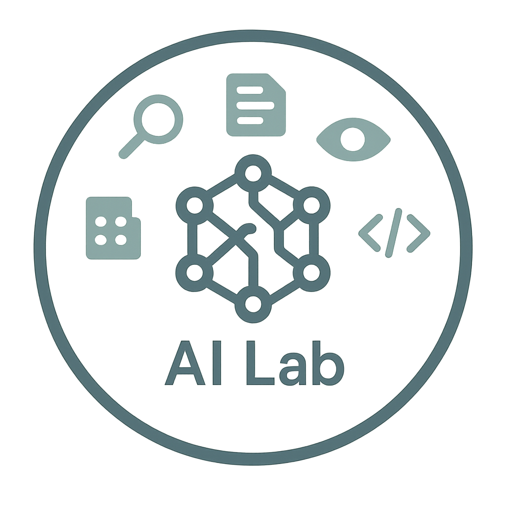

# Open WebUI Docker Extension Suite



[](https://github.com/mairie-de-saint-jean-cap-ferrat/docker-desktop-open-webui/actions/workflows/build.yaml)

Extensión de Docker Desktop que despliega un conjunto de herramientas centrado en [Open WebUI](https://docs.openwebui.com/), configurado para la aceleración GPU NVIDIA (si está disponible) y diversos servicios complementarios, todo accesible a través de una interfaz unificada.


## Características Principales

*   **Interfaz Unificada**: Una barra de navegación permite cambiar fácilmente entre las interfaces web de los diferentes servicios incluidos (Open WebUI, Jupyter, MinIO Console, etc.) sin salir de la extensión.
*   **Open WebUI Preconfigurado**: Interfaz web para interactuar con modelos de lenguaje locales (a través de Ollama) o remotos (API OpenAI, OpenRouter). Aceleración GPU NVIDIA activada por defecto (`ghcr.io/open-webui/open-webui:dev-cuda`).
*   **Verificación GPU Integrada**: Detecta la presencia de herramientas NVIDIA (`nvidia-smi`) y guía al usuario si no se cumplen los requisitos previos (solo para la visualización inicial, la interfaz principal sigue siendo accesible).
*   **Conjunto de Servicios**: Incluye varios servicios útiles para IA y desarrollo.
*   **Información de Credenciales Rápidas**: Un botón en la barra de navegación muestra las credenciales predeterminadas de los servicios (Jupyter, MinIO) en una ventana modal.

## Servicios Incluidos

Esta extensión despliega los siguientes servicios (accesibles a través de `http://host.docker.internal:<PORT>` desde Open WebUI u otros contenedores en la misma red Docker):

*   **Open WebUI** (`:11500`): La interfaz principal para interactuar con LLMs.
*   **Ollama** (`:11434`): Ejecutor para modelos de lenguaje locales. *Integración: Configurado automáticamente (`OLLAMA_BASE_URL`)*.
*   **LibreTranslate** (`:11553`): Servidor de traducción automática de código abierto. *Integración: No integrado por defecto con Open WebUI.*
*   **SearxNG** (`:11505`): Metabuscador respetuoso con la privacidad. *Integración: Configurado como motor de búsqueda web predeterminado para RAG (`SEARXNG_QUERY_URL`)*.
*   **Docling Serve** (`:11551`): Servidor OCR (Reconocimiento Óptico de Caracteres). *Integración: No integrado por defecto con Open WebUI.*
*   **OpenAI Edge TTS** (`:11550`): Servidor Text-to-Speech que utiliza el servicio Edge de Microsoft. *Integración: No integrado por defecto con Open WebUI.*
*   **Jupyter Notebook** (`:11552`): Entorno de desarrollo interactivo. *Integración: Ninguna directa. Accesible a través de su puerto.*
*   **MinIO** (`:11556` Consola, `:11557` Endpoint S3): Almacenamiento de objetos compatible con S3. *Integración: Puede configurarse como proveedor de almacenamiento en Open WebUI (variables `STORAGE_PROVIDER`, `S3_*`).*
*   **Redis** (`:11558`): Base de datos clave-valor en memoria. *Integración: Puede usarse para la gestión de WebSockets (`WEBSOCKET_MANAGER`, `WEBSOCKET_REDIS_URL`) y el almacenamiento en caché (no configurado por defecto).*
*   **Apache Tika** (`:11560`): Conjunto de herramientas de extracción de contenido. *Integración: Configurado para la extracción de texto RAG (`TIKA_SERVER_URL`)*.
*   **MCP Tools** (Puertos `11561` a `11570`): Conjunto de herramientas para el framework MCP (Multi-agent Conversation Protocol) que incluye `filesystem`, `memory`, `time`, `fetch`, `everything`, `sequentialthinking`, `sqlite`, `redis`. *Integración: Ninguna. No accesibles a través de la barra de navegación.*
*   **Servicio MCP_DOCKER** (Vía Extension SDK): Servicio proporcionado por Docker Inc. que da acceso a diversas herramientas de IA a través del servidor MCP configurado por la extensión "AI Tool Catalog". *Integración: Comunicación gestionada por el SDK de la extensión Docker Desktop.*

## Interfaz de Usuario de la Extensión

La interfaz principal de la extensión consta de:

1.  **Barra de Navegación Superior**:
    *   Muestra el nombre "Services:".
    *   Contiene botones para cada servicio que disponga de una interfaz web (Open WebUI, LibreTranslate, SearxNG, Docling Serve, Jupyter, MinIO Console). El botón del servicio activo está resaltado.
    *   Un botón de información (`i`) a la derecha abre una ventana modal que muestra las credenciales predeterminadas para Jupyter y MinIO.
2.  **Marco Principal (Iframe)**:
    *   Muestra la interfaz web del servicio seleccionado a través de la barra de navegación.

## Configuración de Open WebUI

Open WebUI está preconfigurado mediante variables de entorno en `docker-compose.yaml` para usar algunos de los servicios incluidos:

*   **Ollama** (`OLLAMA_BASE_URL=http://host.docker.internal:11434`)
*   **SearxNG para RAG** (`SEARXNG_QUERY_URL=http://host.docker.internal:11505`)
*   **Apache Tika para RAG** (`TIKA_SERVER_URL=http://host.docker.internal:11560`)
*   **API OpenRouter (vía endpoint OpenAI)**: Requiere una clave API (`OPENROUTER_API_KEY`) en un archivo `.env` en la raíz del proyecto.

Puede personalizar aún más la configuración modificando las variables de entorno en `docker-compose.yaml` y reiniciando la extensión. Consulte la [documentación de Open WebUI](https://docs.openwebui.com/) para todas las opciones disponibles.

## Requisitos Previos (Aceleración GPU NVIDIA)

Para beneficiarse de la aceleración GPU con tarjetas NVIDIA, debe realizar **imperativamente** los siguientes pasos **antes** de usar la extensión:

1.  **Instalar los controladores NVIDIA**: Descargue e instale los últimos controladores NVIDIA para su sistema operativo y tarjeta gráfica desde el [sitio web oficial de NVIDIA](https://www.nvidia.com/Download/index.aspx).
2.  **Activar el soporte GPU en Docker Desktop**: Vaya a `Settings` > `Resources` > `Advanced` y active la opción `Enable GPU acceleration` (o similar, el nombre exacto puede variar).
3.  **Reiniciar Docker Desktop**: Después de instalar los controladores y modificar la configuración, reinicie Docker Desktop.

La extensión verificará automáticamente si la herramienta `nvidia-smi` es detectable. Si no es así, mostrará instrucciones para guiarle.

*(Nota: El soporte GPU estándar de Docker Desktop para NVIDIA no está disponible en macOS.)*

## Funcionamiento

La extensión:

1.  Iniciará los servicios definidos en `docker-compose.yaml`.
2.  Verificará la presencia de herramientas NVIDIA en su sistema host a través de un pequeño binario.
3.  Si se detectan las herramientas (`nvidia-smi`), la interfaz de Open WebUI (y los otros servicios configurados) se mostrará y podrá usar la GPU.
4.  Si no se detectan las herramientas o si el SO no es compatible (macOS), se mostrará una guía **inicialmente** con las instrucciones de los requisitos previos antes de cargar la interfaz principal.

## Cómo Instalar

- Instale y ejecute [Docker Desktop](https://www.docker.com/products/docker-desktop/) (o Docker Desktop, si es compatible).
- Asegúrese de que se cumplen los requisitos previos de GPU (ver arriba) si desea aceleración por hardware.
- Ejecute el comando:

  ```sh
  docker extension install ghcr.io/mairie-de-saint-jean-cap-ferrat/docker-desktop-open-webui:<tag>
  # Ejemplo: docker extension install ghcr.io/mairie-de-saint-jean-cap-ferrat/docker-desktop-open-webui:latest
  ```

## Cómo Desinstalar

- Ejecute el comando:

  ```sh
  docker extension uninstall ghcr.io/mairie-de-saint-jean-cap-ferrat/docker-desktop-open-webui:<tag>
  ```

## Cómo Construir la Imagen de la Extensión

- Ejecute el comando:

  ```sh
  docker build -t <nombre-de-su-imagen-extension>:<tag> .
  # Ejemplo: docker build -t mairie-de-saint-jean-cap-ferrat/docker-desktop-open-webui:latest .
  ```

*(Los comandos `rdctl` también se pueden usar si está utilizando Rancher Desktop)*

## Cómo Lanzar una Release

```sh
gh release create vX.Y.Z --generate-notes
``` 