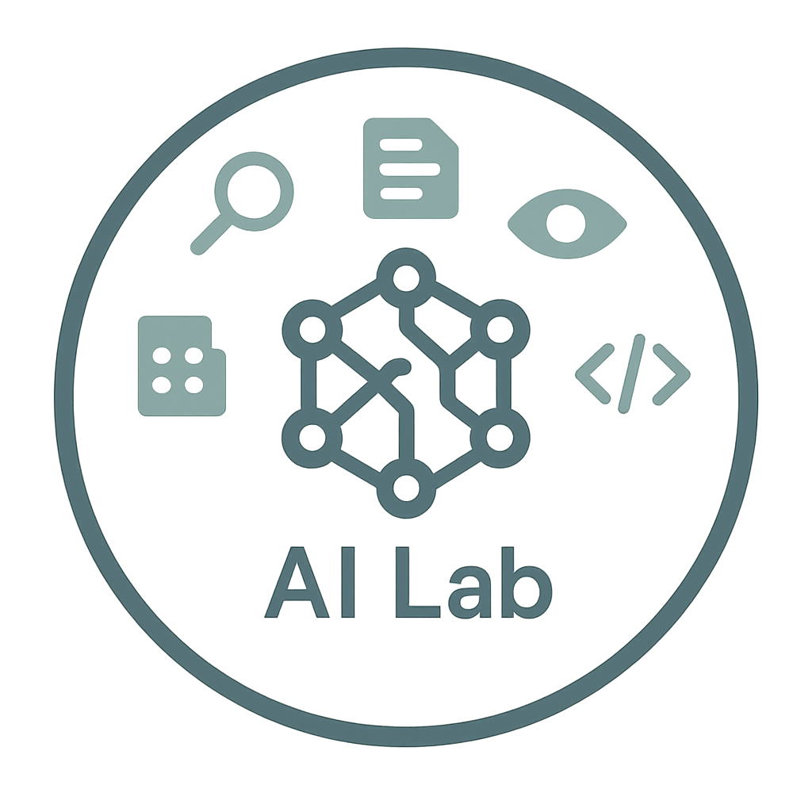

# Пакет расширений Docker Open WebUI



[](https://github.com/mairie-de-saint-jean-cap-ferrat/docker-desktop-open-webui/actions/workflows/build.yaml)

Расширение Docker Desktop, которое развертывает набор инструментов, ориентированный на [Open WebUI](https://docs.openwebui.com/), настроенный для ускорения NVIDIA GPU (если доступно) и различных дополнительных сервисов, доступных через единый интерфейс.


## Основные возможности

*   **Единый интерфейс**: Панель навигации позволяет легко переключаться между веб-интерфейсами различных включенных сервисов (Open WebUI, Jupyter, MinIO Console и т. д.) не выходя из расширения.
*   **Преднастроенный Open WebUI**: Веб-интерфейс для взаимодействия с локальными языковыми моделями (через Ollama) или удаленными (API OpenAI, OpenRouter). Ускорение NVIDIA GPU включено по умолчанию (`ghcr.io/open-webui/open-webui:dev-cuda`).
*   **Интегрированная проверка GPU**: Обнаруживает наличие инструментов NVIDIA (`nvidia-smi`) и направляет пользователя, если предварительные требования не выполнены (только для первоначального отображения, основной интерфейс остается доступным).
*   **Набор сервисов**: Включает несколько полезных сервисов для ИИ и разработки.
*   **Быстрые учетные данные**: Кнопка на панели навигации отображает учетные данные по умолчанию для сервисов (Jupyter, MinIO) в модальном окне.

## Включенные сервисы

Это расширение развертывает следующие сервисы (доступные через `http://host.docker.internal:<PORT>` из Open WebUI или других контейнеров в той же сети Docker):

*   **Open WebUI** (`:11500`): Основной интерфейс для взаимодействия с LLM.
*   **Ollama** (`:11434`): Исполнитель для локальных языковых моделей. *Интеграция: Настроен автоматически (`OLLAMA_BASE_URL`)*.
*   **LibreTranslate** (`:11553`): Сервер автоматического перевода с открытым исходным кодом. *Интеграция: По умолчанию не интегрирован с Open WebUI.*
*   **SearxNG** (`:11505`): Метапоисковая система, уважающая конфиденциальность. *Интеграция: Настроен как поисковая система по умолчанию для RAG (`SEARXNG_QUERY_URL`)*.
*   **Docling Serve** (`:11551`): Сервер OCR (Оптическое распознавание символов). *Интеграция: По умолчанию не интегрирован с Open WebUI.*
*   **OpenAI Edge TTS** (`:11550`): Сервер Text-to-Speech, использующий сервис Microsoft Edge. *Интеграция: По умолчанию не интегрирован с Open WebUI.*
*   **Jupyter Notebook** (`:11552`): Интерактивная среда разработки. *Интеграция: Прямой нет. Доступен через свой порт.*
*   **MinIO** (`:11556` Консоль, `:11557` Конечная точка S3): Объектное хранилище, совместимое с S3. *Интеграция: Может быть настроен как поставщик хранилища в Open WebUI (переменные `STORAGE_PROVIDER`, `S3_*`).*
*   **Redis** (`:11558`): База данных ключ-значение в памяти. *Интеграция: Может использоваться для управления WebSocket (`WEBSOCKET_MANAGER`, `WEBSOCKET_REDIS_URL`) и кэширования (по умолчанию не настроено).*
*   **Apache Tika** (`:11560`): Инструментарий для извлечения контента. *Интеграция: Настроен для извлечения текста RAG (`TIKA_SERVER_URL`)*.
*   **MCP Tools** (Порты `11561` до `11570`): Набор инструментов для фреймворка MCP (Multi-agent Conversation Protocol), включая `filesystem`, `memory`, `time`, `fetch`, `everything`, `sequentialthinking`, `sqlite`, `redis`. *Интеграция: Нет. Недоступны через панель навигации.*
*   **Сервис MCP_DOCKER** (Через Extension SDK): Сервис, предоставляемый Docker Inc., дающий доступ к различным инструментам ИИ через сервер MCP, настроенный расширением "AI Tool Catalog". *Интеграция: Связь управляется SDK расширения Docker Desktop.*

## Пользовательский интерфейс расширения

Основной интерфейс расширения состоит из:

1.  **Верхняя панель навигации**:
    *   Отображает имя "Services:".
    *   Содержит кнопки для каждого сервиса с веб-интерфейсом (Open WebUI, LibreTranslate, SearxNG, Docling Serve, Jupyter, MinIO Console). Кнопка активного сервиса выделена.
    *   Кнопка информации (`i`) справа открывает модальное окно, отображающее учетные данные по умолчанию для Jupyter и MinIO.
2.  **Основной фрейм (Iframe)**:
    *   Отображает веб-интерфейс сервиса, выбранного через панель навигации.

## Конфигурация Open WebUI

Open WebUI предварительно настроен через переменные среды в `docker-compose.yaml` для использования некоторых включенных сервисов:

*   **Ollama** (`OLLAMA_BASE_URL=http://host.docker.internal:11434`)
*   **SearxNG для RAG** (`SEARXNG_QUERY_URL=http://host.docker.internal:11505`)
*   **Apache Tika для RAG** (`TIKA_SERVER_URL=http://host.docker.internal:11560`)
*   **API OpenRouter (через конечную точку OpenAI)**: Требуется ключ API (`OPENROUTER_API_KEY`) в файле `.env` в корне проекта.

Вы можете дополнительно настроить конфигурацию, изменив переменные среды в `docker-compose.yaml` и перезапустив расширение. Обратитесь к [документации Open WebUI](https://docs.openwebui.com/) для получения всех доступных опций.

## Предварительные требования (Ускорение NVIDIA GPU)

Чтобы воспользоваться ускорением GPU с картами NVIDIA, вы **обязательно** должны выполнить следующие шаги **перед** использованием расширения:

1.  **Установить драйверы NVIDIA**: Загрузите и установите последние драйверы NVIDIA для вашей операционной системы и видеокарты с [официального сайта NVIDIA](https://www.nvidia.com/Download/index.aspx).
2.  **Включить поддержку GPU в Docker Desktop**: Перейдите в `Settings` > `Resources` > `Advanced` и включите опцию `Enable GPU acceleration` (или аналогичную, точное название может отличаться).
3.  **Перезапустить Docker Desktop**: После установки драйверов и изменения настроек перезапустите Docker Desktop.

Расширение автоматически проверит, доступен ли инструмент `nvidia-smi`. Если нет, оно отобразит инструкции для вас.

*(Примечание: Стандартная поддержка GPU Docker Desktop для NVIDIA недоступна в macOS.)*

## Как это работает

Расширение:

1.  Запустит сервисы, определенные в `docker-compose.yaml`.
2.  Проверит наличие инструментов NVIDIA в вашей хост-системе с помощью небольшого бинарного файла.
3.  Если инструменты обнаружены (`nvidia-smi`), интерфейс Open WebUI (и другие настроенные сервисы) будет отображен и сможет использовать GPU.
4.  Если инструменты не обнаружены или ОС не поддерживается (macOS), **изначально** будет отображено руководство с инструкциями по предварительным требованиям перед загрузкой основного интерфейса.

## Как установить

- Установите и запустите [Docker Desktop](https://www.docker.com/products/docker-desktop/) (или Docker Desktop, если совместим).
- Убедитесь, что выполнены предварительные требования для GPU (см. выше), если вы хотите использовать аппаратное ускорение.
- Выполните команду:

  ```sh
  docker extension install ghcr.io/mairie-de-saint-jean-cap-ferrat/docker-desktop-open-webui:<tag>
  # Пример: docker extension install ghcr.io/mairie-de-saint-jean-cap-ferrat/docker-desktop-open-webui:latest
  ```

## Как удалить

- Выполните команду:

  ```sh
  docker extension uninstall ghcr.io/mairie-de-saint-jean-cap-ferrat/docker-desktop-open-webui:<tag>
  ```

## Как собрать образ расширения

- Выполните команду:

  ```sh
  docker build -t <your-extension-image-name>:<tag> .
  # Пример: docker build -t mairie-de-saint-jean-cap-ferrat/docker-desktop-open-webui:latest .
  ```

*(Команды `rdctl` также могут использоваться, если вы используете Rancher Desktop)*

## Как выпустить релиз

```sh
gh release create vX.Y.Z --generate-notes
``` 