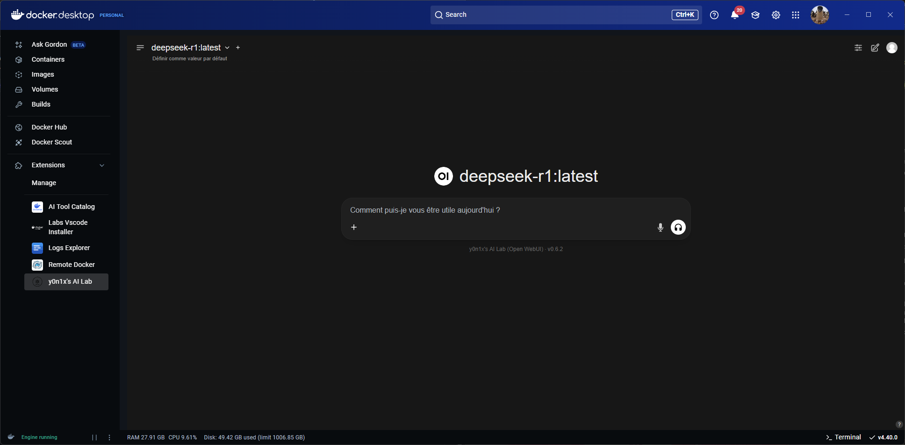

# ชุดส่วนขยาย Open WebUI Docker


[](https://github.com/mairie-de-saint-jean-cap-ferrat/docker-desktop-open-webui/actions/workflows/build.yaml)

ส่วนขยาย Docker Desktop ที่ปรับใช้ชุดเครื่องมือที่เน้น [Open WebUI](https://docs.openwebui.com/) ซึ่งกำหนดค่าสำหรับการเร่งความเร็ว NVIDIA GPU (หากมี) และบริการเสริมต่างๆ ทั้งหมดสามารถเข้าถึงได้ผ่านอินเทอร์เฟซแบบรวมศูนย์



## คุณสมบัติหลัก

*   **อินเทอร์เฟซแบบรวมศูนย์**: แถบนำทางช่วยให้สลับระหว่างอินเทอร์เฟซเว็บของบริการต่างๆ ที่รวมอยู่ (Open WebUI, Jupyter, MinIO Console เป็นต้น) ได้อย่างง่ายดายโดยไม่ต้องออกจากส่วนขยาย
*   **Open WebUI ที่กำหนดค่าไว้ล่วงหน้า**: อินเทอร์เฟซเว็บสำหรับโต้ตอบกับโมเดลภาษาท้องถิ่น (ผ่าน Ollama) หรือโมเดลระยะไกล (API OpenAI, OpenRouter) เปิดใช้งานการเร่งความเร็ว NVIDIA GPU โดยค่าเริ่มต้น (`ghcr.io/open-webui/open-webui:dev-cuda`)
*   **การตรวจสอบ GPU ในตัว**: ตรวจจับการมีอยู่ของเครื่องมือ NVIDIA (`nvidia-smi`) และแนะนำผู้ใช้หากไม่ตรงตามข้อกำหนดเบื้องต้น (เฉพาะสำหรับการแสดงผลเริ่มต้น อินเทอร์เฟซหลักยังคงเข้าถึงได้)
*   **ชุดบริการ**: รวมบริการที่มีประโยชน์หลายอย่างสำหรับ AI และการพัฒนา
*   **ข้อมูลประจำตัวด่วน**: ปุ่มในแถบนำทางจะแสดงข้อมูลประจำตัวเริ่มต้นสำหรับบริการ (Jupyter, MinIO) ในหน้าต่างโมดอล

## บริการที่รวมอยู่

ส่วนขยายนี้ปรับใช้บริการต่อไปนี้ (เข้าถึงได้ผ่าน `http://host.docker.internal:<PORT>` จาก Open WebUI หรือคอนเทนเนอร์อื่น ๆ ในเครือข่าย Docker เดียวกัน):

*   **Open WebUI** (`:11500`): อินเทอร์เฟซหลักสำหรับโต้ตอบกับ LLM
*   **Ollama** (`:11434`): ตัวเรียกใช้สำหรับโมเดลภาษาท้องถิ่น *การรวม: กำหนดค่าโดยอัตโนมัติ (`OLLAMA_BASE_URL`)*
*   **LibreTranslate** (`:11553`): เซิร์ฟเวอร์แปลภาษาอัตโนมัติแบบโอเพนซอร์ส *การรวม: ไม่รวมเข้ากับ Open WebUI โดยค่าเริ่มต้น*
*   **SearxNG** (`:11505`): เครื่องมือค้นหาเมตาที่เคารพความเป็นส่วนตัว *การรวม: กำหนดค่าเป็นเครื่องมือค้นหาเว็บเริ่มต้นสำหรับ RAG (`SEARXNG_QUERY_URL`)*
*   **Docling Serve** (`:11551`): เซิร์ฟเวอร์ OCR (การรู้จำอักขระด้วยแสง) *การรวม: ไม่รวมเข้ากับ Open WebUI โดยค่าเริ่มต้น*
*   **OpenAI Edge TTS** (`:11550`): เซิร์ฟเวอร์ Text-to-Speech ที่ใช้บริการ Edge ของ Microsoft *การรวม: ไม่รวมเข้ากับ Open WebUI โดยค่าเริ่มต้น*
*   **Jupyter Notebook** (`:11552`): สภาพแวดล้อมการพัฒนาแบบโต้ตอบ *การรวม: ไม่มีโดยตรง เข้าถึงได้ผ่านพอร์ต*
*   **MinIO** (`:11556` คอนโซล, `:11557` ปลายทาง S3): ที่เก็บอ็อบเจกต์ที่เข้ากันได้กับ S3 *การรวม: สามารถกำหนดค่าเป็นผู้ให้บริการที่เก็บข้อมูลใน Open WebUI (ตัวแปร `STORAGE_PROVIDER`, `S3_*`)*
*   **Redis** (`:11558`): ฐานข้อมูลคีย์-ค่าในหน่วยความจำ *การรวม: สามารถใช้สำหรับการจัดการ WebSocket (`WEBSOCKET_MANAGER`, `WEBSOCKET_REDIS_URL`) และการแคช (ไม่ได้กำหนดค่าโดยค่าเริ่มต้น)*
*   **Apache Tika** (`:11560`): ชุดเครื่องมือการแยกเนื้อหา *การรวม: กำหนดค่าสำหรับการแยกข้อความ RAG (`TIKA_SERVER_URL`)*
*   **MCP Tools** (พอร์ต `11561` ถึง `11570`): ชุดเครื่องมือสำหรับเฟรมเวิร์ก MCP (Multi-agent Conversation Protocol) รวมถึง `filesystem`, `memory`, `time`, `fetch`, `everything`, `sequentialthinking`, `sqlite`, `redis` *การรวม: ไม่มี ไม่สามารถเข้าถึงได้ผ่านแถบนำทาง*
*   **บริการ MCP_DOCKER** (ผ่าน Extension SDK): บริการที่จัดทำโดย Docker Inc. ให้สิทธิ์เข้าถึงเครื่องมือ AI ต่างๆ ผ่านเซิร์ฟเวอร์ MCP ที่กำหนดค่าโดยส่วนขยาย "AI Tool Catalog" *การรวม: การสื่อสารจัดการโดย SDK ส่วนขยาย Docker Desktop*

## ส่วนต่อประสานผู้ใช้ส่วนขยาย

อินเทอร์เฟซหลักของส่วนขยายประกอบด้วย:

1.  **แถบนำทางด้านบน**:
    *   แสดงชื่อ "Services:"
    *   มีปุ่มสำหรับแต่ละบริการที่มีอินเทอร์เฟซเว็บ (Open WebUI, LibreTranslate, SearxNG, Docling Serve, Jupyter, MinIO Console) ปุ่มของบริการที่ใช้งานอยู่จะถูกเน้น
    *   ปุ่มข้อมูล (`i`) ทางด้านขวาจะเปิดหน้าต่างโมดอลที่แสดงข้อมูลประจำตัวเริ่มต้นสำหรับ Jupyter และ MinIO
2.  **เฟรมหลัก (Iframe)**:
    *   แสดงอินเทอร์เฟซเว็บของบริการที่เลือกผ่านแถบนำทาง

## การกำหนดค่า Open WebUI

Open WebUI ได้รับการกำหนดค่าล่วงหน้าผ่านตัวแปรสภาพแวดล้อมใน `docker-compose.yaml` เพื่อใช้บริการบางอย่างที่รวมอยู่:

*   **Ollama** (`OLLAMA_BASE_URL=http://host.docker.internal:11434`)
*   **SearxNG สำหรับ RAG** (`SEARXNG_QUERY_URL=http://host.docker.internal:11505`)
*   **Apache Tika สำหรับ RAG** (`TIKA_SERVER_URL=http://host.docker.internal:11560`)
*   **API OpenRouter (ผ่านปลายทาง OpenAI)**: ต้องใช้คีย์ API (`OPENROUTER_API_KEY`) ในไฟล์ `.env` ที่รากของโปรเจ็กต์

คุณสามารถปรับแต่งการกำหนดค่าเพิ่มเติมได้โดยการแก้ไขตัวแปรสภาพแวดล้อมใน `docker-compose.yaml` และรีสตาร์ทส่วนขยาย ดู [เอกสารประกอบ Open WebUI](https://docs.openwebui.com/) สำหรับตัวเลือกทั้งหมดที่มีอยู่

## ข้อกำหนดเบื้องต้น (การเร่งความเร็ว NVIDIA GPU)

เพื่อให้ได้ประโยชน์จากการเร่งความเร็ว GPU ด้วยการ์ด NVIDIA คุณ**ต้อง**ดำเนินการตามขั้นตอนต่อไปนี้**ก่อน**ใช้ส่วนขยาย:

1.  **ติดตั้งไดรเวอร์ NVIDIA**: ดาวน์โหลดและติดตั้งไดรเวอร์ NVIDIA ล่าสุดสำหรับระบบปฏิบัติการและการ์ดกราฟิกของคุณจาก [เว็บไซต์ NVIDIA อย่างเป็นทางการ](https://www.nvidia.com/Download/index.aspx)
2.  **เปิดใช้งานการสนับสนุน GPU ใน Docker Desktop**: ไปที่ `Settings` > `Resources` > `Advanced` และเปิดใช้งานตัวเลือก `Enable GPU acceleration` (หรือคล้ายกัน ชื่อที่แน่นอนอาจแตกต่างกันไป)
3.  **รีสตาร์ท Docker Desktop**: หลังจากติดตั้งไดรเวอร์และเปลี่ยนการตั้งค่าแล้ว ให้รีสตาร์ท Docker Desktop

ส่วนขยายจะตรวจสอบโดยอัตโนมัติว่าสามารถตรวจพบเครื่องมือ `nvidia-smi` ได้หรือไม่ หากไม่เป็นเช่นนั้น จะแสดงคำแนะนำเพื่อแนะนำคุณ

*(หมายเหตุ: การสนับสนุน GPU มาตรฐานของ Docker Desktop สำหรับ NVIDIA ไม่มีให้ใช้งานบน macOS)*

## วิธีการทำงาน

ส่วนขยายจะ:

1.  เริ่มบริการที่กำหนดไว้ใน `docker-compose.yaml`
2.  ตรวจสอบการมีอยู่ของเครื่องมือ NVIDIA บนระบบโฮสต์ของคุณผ่านไบนารีขนาดเล็ก
3.  หากตรวจพบเครื่องมือ (`nvidia-smi`) อินเทอร์เฟซ Open WebUI (และบริการอื่น ๆ ที่กำหนดค่าไว้) จะปรากฏขึ้นและสามารถใช้ GPU ได้
4.  หากตรวจไม่พบเครื่องมือหรือไม่รองรับ OS (macOS) คำแนะนำจะแสดง**เริ่มแรก**พร้อมคำแนะนำข้อกำหนดเบื้องต้นก่อนที่จะโหลดอินเทอร์เฟซหลัก

## วิธีการติดตั้ง

- ติดตั้งและเปิดใช้ [Docker Desktop](https://www.docker.com/products/docker-desktop/) (หรือ Docker Desktop หากเข้ากันได้)
- ตรวจสอบให้แน่ใจว่าตรงตามข้อกำหนดเบื้องต้นของ GPU (ดูด้านบน) หากคุณต้องการการเร่งความเร็วฮาร์ดแวร์
- เรียกใช้คำสั่ง:

  ```sh
  docker extension install ghcr.io/mairie-de-saint-jean-cap-ferrat/docker-desktop-open-webui:<tag>
  # ตัวอย่าง: docker extension install ghcr.io/mairie-de-saint-jean-cap-ferrat/docker-desktop-open-webui:latest
  ```

## วิธีการถอนการติดตั้ง

- เรียกใช้คำสั่ง:

  ```sh
  docker extension uninstall ghcr.io/mairie-de-saint-jean-cap-ferrat/docker-desktop-open-webui:<tag>
  ```

## วิธีการสร้างอิมเมจส่วนขยาย

- เรียกใช้คำสั่ง:

  ```sh
  docker build -t <your-extension-image-name>:<tag> .
  # ตัวอย่าง: docker build -t mairie-de-saint-jean-cap-ferrat/docker-desktop-open-webui:latest .
  ```

*(คำสั่ง `rdctl` สามารถใช้ได้หากคุณใช้ Rancher Desktop)*

## วิธีการเผยแพร่

```sh
gh release create vX.Y.Z --generate-notes
``` 